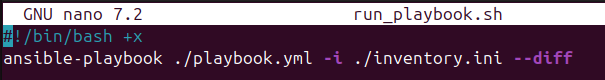

### Фельк Дмитрий Александрович ФИТ-2-2024 НМ

# Практическая работа 6-1. Деплой веб-сервера с помощью Ansible.

#### <u>Задание:</u> 

1. #### Сделать role, которая устанавливает nginx c vhosts
2. #### Роль устанавливает nginx
3. #### Виртуальные сайты задавать параметрами роли (playbook/play/vars)

  #### 	Пример:

  #### 		var:

  #### 			sites:

  #### 			– iknt.ru

  #### 			– fizmat.ru

  #### 			– etis.com
4. #### Для каждого vhost из шаблона index.html.j2 создавать индексный файл
5. #### Для каждого vhost из шаблона {{site}}.conf.j2 создавать конфигурацию веб-сервера
6. #### Проверка через curl или браузер с подменой DNS

Структура будущей роли:

Прописываем задачу установки nginx на хост:

Копирование в цикле конфига для виртуального хоста, каждый раз с новым именем и с новым содержимым:

Заполняем конфиг виртуального хоста vhost:

Заполняем шаблон стартовой страницы vhost:

Копирование стартовых страниц в цикле в каждый виртуальный сайт:

Перезагрузка nginx путем добавления таски в tasks/main.yml:

Заполняем плейбук:

Создаем скрипт для запуска плейбука с ролью:

Запускаем плейбук:

Правим файл /etc/hosts:

Проверка из командной строки
